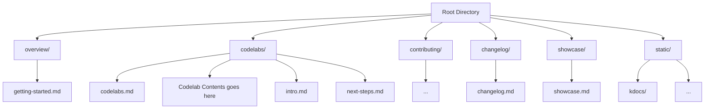

# Website

This website is built using [Docusaurus](https://docusaurus.io/), a modern static website generator.

## Installation

```bash
npm i
```

## Local Development

```bash
npm start
```

This command starts a local development server and opens up a browser window. Most changes are reflected live without having to restart the server.

## Build

```bash
npm run build
```

This command generates static content into the `build` directory and can be served using any static contents hosting service.

## Architecture




## CI Config

### Overview
This project uses two repositories with automated documentation integration:

Kotlin Repo: Source code with KDocs
Docusaurus Repo: Documentation site that displays the generated API docs

```

┌─────────────────────┐     ┌──────────────────────┐
│  Kotlin Repository  │     │ Docusaurus Repository│
│                     │     │                      │
│  ┌───────────────┐  │     │  ┌───────────────┐   │
│  │  Source Code  │  │     │  │  Markdown     │   │
│  └───────┬───────┘  │     │  │  Documentation│   │
│          │          │     │  └───────────────┘   │
│  ┌───────▼───────┐  │     │                      │
│  │  Dokka Tool   │  │     │  ┌───────────────┐   │
│  └───────┬───────┘  │     │  │  Static Dir   │   │
│          │          │     │  │  ┌─────────┐  │   │
│  ┌───────▼───────┐  │     │  │  │ /api/   │◄─┼───┘
│  │ Generated     │  │     │  │  └─────────┘  │   │
│  │ API Docs      │──┼─────┼─►│               │   │
│  └───────────────┘  │     │  └───────────────┘   │
└─────────────────────┘     └──────────────────────┘

```

### Automation Workflow
[Code Changes] → [Trigger Action] → [Build KDocs] → [Copy to Docusaurus] → [Deploy Site]

GitHub Actions Setup

1. In Multipaz Repository => [.github/workflows/trigger-docusaurus-update.yml](https://github.com/openwallet-foundation/multipaz/blob/main/.github/workflows/trigger-docusaurus-update.yml)
2. In Multipaz Developer Website Repository => [.github/workflows/docs.yml](https://github.com/openwallet-foundation/multipaz-developer-website/blob/main/.github/workflows/docs.yml)

### Required Repository Settings

To enable automatic documentation updates between repositories, you need to set up a Personal Access Token (PAT).

#### Step 1: Generate Personal Access Token

1. **Go to GitHub Settings**: Navigate to [https://github.com/settings/personal-access-tokens/new](https://github.com/settings/personal-access-tokens/new)
2. **Select Token Type**: Choose "Fine-grained personal access tokens"
3. **Configure Token Settings**:
   - **Token name**: `DOCS_REPO_ACCESS_TOKEN`
   - **Description**: `Token for automated documentation updates between multipaz and developer website repo`
   - **Expiration**: `366 days` (or your preferred duration)
4. **Set Repository Access**:
   - **Resource Owner**: `openwallet-foundation`
   - **Repository access**: `Selected repositories`
   - **Select repository**: `openwallet-foundation/multipaz-developer-website`
5. **Set Permissions**:
   - **Content**: `Read and write`
   - **Metadata**: `Read`
6. **Generate Token**: Click "Generate token" and **copy the token immediately** (it won't be shown again)

#### Step 2: Add Token as Repository Secret

1. **Go to Multipaz Repository**: Navigate to [https://github.com/openwallet-foundation/multipaz/settings/secrets/actions](https://github.com/openwallet-foundation/multipaz/settings/secrets/actions)
2. **Add New Secret**:
   - Click "New repository secret"
   - **Name**: `DOCS_REPO_ACCESS_TOKEN`
   - **Secret**: Paste the token you generated in Step 1
   - Click "Add secret"

#### What This Enables

This setup allows the [Trigger Docs Update workflow](https://github.com/openwallet-foundation/multipaz/blob/main/.github/workflows/trigger-docusaurus-update.yml) to automatically update the developer website whenever changes are made to the multipaz repository.

## GitHub Pages Setup

Docusaurus can run in two modes depending on your deployment setup:

### Option 1: Custom Domain (PRODUCTION mode)
For custom domains like `developer.multipaz.org`:

1. **Enable GitHub Pages**: In Docusaurus repo, go to **Settings → Pages** and enable GitHub Pages with GitHub Actions as source
2. **Set Custom Domain**: Under **Custom domain**, enter:  
   ```
   developer.multipaz.org
   ```  
3. **Save Changes**: Click save to apply the custom domain
4. **Verify DNS**: Optionally, verify that DNS settings (CNAME or A records) are set properly for `developer.multipaz.org` pointing to GitHub Pages
5. **Set Environment Variable**: Configure `WEBSITE_ENVIRONMENT` GitHub repository variable as `PRODUCTION`

### Option 2: GitHub Pages Subdomain (DEVELOPMENT mode)
For github.io pages like `openwallet-foundation.github.io/multipaz-developer-website`:

1. **Enable GitHub Pages**: In Docusaurus repo, go to **Settings → Pages** and enable GitHub Pages with GitHub Actions as source
2. **Set Environment Variable**: Configure `WEBSITE_ENVIRONMENT` GitHub repository variable as `DEVELOPMENT`
3. **No Custom Domain**: Leave the custom domain field empty

### Deployment
After configuration:
- Trigger the [`Build and Deploy Docusaurus with KDocs`](https://github.com/openmobilehub/developer-multipaz-website/actions/workflows/docs.yml) workflow
- The `baseUrl` will automatically be set to:
  - `/` for custom domains (PRODUCTION mode)
  - `/{repository_name}` for github.io pages (DEVELOPMENT mode)

### Reference
See GitHub's guide for more details: [Configuring a custom domain for your GitHub Pages site](https://docs.github.com/en/pages/configuring-a-custom-domain-for-your-github-pages-site)
