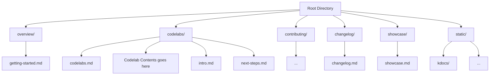

# Website

This website is built using [Docusaurus](https://docusaurus.io/), a modern static website generator.

## Installation

```bash
npm i
```

## Local Development

```bash
npm start
```

This command starts a local development server and opens up a browser window. Most changes are reflected live without having to restart the server.

## Build

```bash
npm run build
```

This command generates static content into the `build` directory and can be served using any static contents hosting service.

## Architecture




## CI Config

### Overview
This project uses two repositories with automated documentation integration:

Kotlin Repo: Source code with KDocs
Docusaurus Repo: Documentation site that displays the generated API docs

```

┌─────────────────────┐     ┌──────────────────────┐
│  Kotlin Repository  │     │ Docusaurus Repository│
│                     │     │                      │
│  ┌───────────────┐  │     │  ┌───────────────┐   │
│  │  Source Code  │  │     │  │  Markdown     │   │
│  └───────┬───────┘  │     │  │  Documentation│   │
│          │          │     │  └───────────────┘   │
│  ┌───────▼───────┐  │     │                      │
│  │  Dokka Tool   │  │     │  ┌───────────────┐   │
│  └───────┬───────┘  │     │  │  Static Dir   │   │
│          │          │     │  │  ┌─────────┐  │   │
│  ┌───────▼───────┐  │     │  │  │ /api/   │◄─┼───┘
│  │ Generated     │  │     │  │  └─────────┘  │   │
│  │ API Docs      │──┼─────┼─►│               │   │
│  └───────────────┘  │     │  └───────────────┘   │
└─────────────────────┘     └──────────────────────┘

```

### Automation Workflow
[Code Changes] → [Trigger Action] → [Build KDocs] → [Copy to Docusaurus] → [Deploy Site]

GitHub Actions Setup

1. In Kotlin Repository => [.github/workflows/trigger-docusaurus-update.yml](https://github.com/VishnuSanal/multipaz-identity-credential/blob/main/.github/workflows/trigger-docusaurus-update.yml)
2. In Docusaurus Repository => [.github/workflows/docs.yml](https://github.com/openmobilehub/developer-multipaz-website/blob/main/.github/workflows/docs.yml)

### Required Repository Settings

Secrets:

- In Kotlin repo: `DOCS_REPO_ACCESS_TOKEN` (GitHub PAT with repo scope)
- In Docusaurus repo (if Kotlin repo is private): KOTLIN_REPO_ACCESS_TOKEN

### GitHub Pages:

In Docusaurus repo: Enable GitHub Pages with GitHub Actions as source
